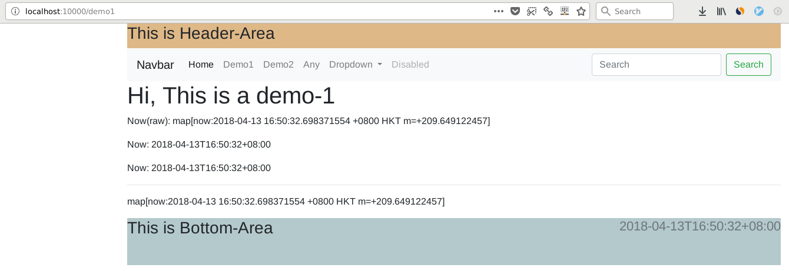
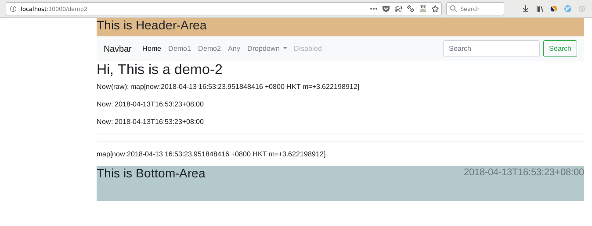
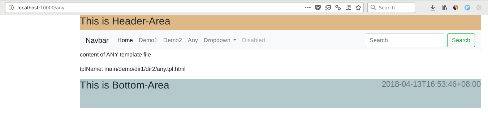

Go(Golang) template manager, especially suited for web. Already supports [gin](https://github.com/gin-gonic/gin) server.
========================================================
1. [Install](#install)
2. [Description](#description)
3. [TemplateEnv](#templateenv)
4. [Examples](#examples)
5. [Config Comments](#config-comments)
6. [Deploy Mode](#deploy-mode)
7. [Screenshots](#screenshots)
7. [Benchmark](#benchmark)
7. [A complete example of gin web server](#a-complete-example-of-gin-web-server.)
7. [A Complete example of net/http server](#a-complete-example-of-net/http-server)
7. [Licence](#licence)


## Install 
go get github.com/darkdarkfruit/templatemanager

Then use it:
```
import github.com/darkdarkfruit/templatemanager
```


## Description
Go(Golang) template manager, especially suited for web. Already supports [gin](https://github.com/gin-gonic/gin) server.

Features:
* support debug mode (Re-render the template when next request comes.)
* support production mode (Automatically enables template cache.)
* support context-render (template (nest/inheritance almost))
* support single file render (the same as html/template)
* support multiple files render (the same as html/template)
* support gin-gonic(gin) already

## TemplateEnv
There are 2 types of templateEnv(aka: 2 types of templateName). 
Default is ContextMode which uses template nesting(somewhat like template-inheritance in django/jinja2/...)

ContextMode will load context templates, then execute template in file: `FilePathOfBaseRelativeToRoot`.

FilesMode is basically the same as http/template

1. ContextMode: Name starts with "C->" or not starts with "F->"
```
	eg: "C->main/demo/demo.tpl.html"
	 or "C-> main/demo/demo.tpl.html" (not: blanks before file(main/demo/demo.tpl.html) will be discarded)
	 or	"main/demo/demo.tpl.html"
```
2. FilesMode:   Name starts with "F->". (default separator of multiple files is ";")
```
	eg: "F->main/demo/demo.tpl.html"
     or "F-> main/demo/demo.tpl.html"
     or "F-> main/demo/demo.tpl.html;main/demo/demo_ads.tpl.html" (will use the first file name when executing template)
```

## Examples
See detailed examples at [examples/](./examples)

### We will use the templates layout below:
```

templates/
├── context
│   ├── layout
│   │   └── layout.tpl.html
│   └── partial
│       └── ads.tpl.html
└── main
    └── demo
        ├── demo1.tpl.html
        ├── demo2.tpl.html
        └── dir1
            └── dir2
                └── any.tpl.html

```

#### A very basic example.
```
// use gin as web server
...

func main(){
    router := gin.Default() // 
    tplMgr := templatemanager.Default(true)
    tplMgr.Init(true)
    router.HTMLRender = tplMgr 
}

...
	
```

#### A customized example
```
// use gin as web server
...

func main(){
    router := gin.Default() // 
    tplConfig := templatemanager.DefaultConfig(gin.IsDebugging())
    tplConfig.DirOfRoot = templatesDir
    tplConfig.FuncMap = template.FuncMap{
    	"FormatAsDate":   FormatAsDate,
    	"time_ISOFormat": TimeISOFormat,
    	"unescaped":      unescaped,
    	}
    tplMgr := templatemanager.New(tplConfig)
    tplMgr.Init(true)
    router.HTMLRender = tplMgr 
}

...
	
```

## Config comments
``` 
type TemplateConfig struct {
	DirOfRoot                    string           //template root dir
	DirOfMainRelativeToRoot      string           //template dir: main
	DirOfContextRelativeToRoot   string           //template dir: context
	FilePathOfBaseRelativeToRoot string           //template layout file path
	Extension                    string           //template extension
	FuncMap                      template.FuncMap //template functions
	Delims                       Delims           //delimeters

	IsDebugging bool // true: Show debug info; false: disable debug info and enable cache.
}
```

## Deploy mode
1. debug mode
``` 
set "config: IsDebugging" to true.
eg:
    templatemanager.Default(true)
```

2. production mode
``` 
set "config: isDebugging" to false
    templatemanager.Default(true)
```

3. set by gin web server
```
    templatemanager.Default(gin.IsDebugging()) 
```


## Screenshots
```
Take examples/gin_web_server as an example
```

1. demo1
    
1. demo2
    
1. any file at any depth of main directory
    


## Benchmark
Env:
 
    CPU: (Years ago with very poor performance)AMD Athlon(tm) X4 850 Quad Core Processor
    MEM: 8G


```bash
# debug-mode
> wrk -d5 'http://localhost:10000/demo1'
Running 5s test @ http://localhost:10000/demo1
  2 threads and 10 connections
  Thread Stats   Avg      Stdev     Max   +/- Stdev
    Latency     4.97ms    5.06ms  50.28ms   86.82%
    Req/Sec     1.27k   295.83     2.61k    76.00%
  12695 requests in 5.01s, 53.21MB read
Requests/sec:   2532.09
Transfer/sec:     10.61MB

```

```bash
# production-mode
> wrk -d5 'http://localhost:10000/demo1'
Running 5s test @ http://localhost:10000/demo1
  2 threads and 10 connections
  Thread Stats   Avg      Stdev     Max   +/- Stdev
    Latency     1.21ms    2.32ms  36.00ms   90.58%
    Req/Sec    10.09k     1.82k   15.99k    70.00%
  100514 requests in 5.01s, 421.08MB read
Requests/sec:  20073.50
Transfer/sec:     84.09MB

```

## A Complete example of net/http server
```go
package main

import (
	"log"
	"github.com/darkdarkfruit/templatemanager"
	"time"
	"net/http"
	"html/template"
)

var isDebugging bool
var tplMgr *templatemanager.TemplateManager

//func init() {
//}

func time_isoformat(t time.Time) string {
	return t.Format(time.RFC3339)
}

func HomeHandler(w http.ResponseWriter, req *http.Request) {
	tplMgr.ExecuteTemplate(w, "main/home/home.tpl.html", map[string]interface{}{
		"now": time.Now(),
	})
}

func Demo1Handler(w http.ResponseWriter, req *http.Request) {
	tplMgr.ExecuteTemplate(w, "main/demo/demo1.tpl.html", map[string]interface{}{
		"now": time.Now(),
	})
}

func Demo2Handler(w http.ResponseWriter, req *http.Request) {
	tplMgr.ExecuteTemplate(w, "main/demo/demo2.tpl.html", map[string]interface{}{
		"now": time.Now(),
	})
}

func AnyFileHandler(w http.ResponseWriter, req *http.Request) {
	tplName := "main/demo/dir1/dir2/any.tpl.html"
	tplMgr.ExecuteTemplate(w, tplName, map[string]interface{}{
		"now":     time.Now(),
		"tplName": tplName,
	})
}

func main() {
	log.SetFlags(log.LstdFlags | log.Lshortfile)
	isDebugging = true
	tplMgr = templatemanager.Default(isDebugging)
	tplMgr.Config.FuncMap = template.FuncMap{
		"time_isoformat": time_isoformat,
	}
	tplMgr.Init(true)

	mux := http.NewServeMux()
	log.Printf("isDebugging: %v", isDebugging)

	mux.HandleFunc("/", HomeHandler)
	mux.HandleFunc("/demo1", Demo1Handler)
	mux.HandleFunc("/demo2", Demo2Handler)
	mux.HandleFunc("/any", AnyFileHandler)

	addr := ":10001"
	httpAddr := "http://localhost" + addr
	log.Printf("urls are: \n%s/ \n%s/demo1 \n%s/demo2 \n%s/any \n", httpAddr, httpAddr, httpAddr, httpAddr)
	log.Printf("net-http-server is running at %s", addr)
	http.ListenAndServe(addr, mux)
}

```

## A complete example of gin web server
```go
package main

import (
	"log"
	"github.com/darkdarkfruit/templatemanager"
	"github.com/gin-gonic/gin"
	"html/template"
	"time"
	"net/http"
)

func time_isoformat(t time.Time) string {
	return t.Format(time.RFC3339)
}

func HomeHandler(c *gin.Context) {
	c.HTML(http.StatusOK, "main/home/home.tpl.html", gin.H{
		"now": time.Now(),
	})
}

func Demo1Handler(c *gin.Context) {
	c.HTML(http.StatusOK, "main/demo/demo1.tpl.html", gin.H{
		"now": time.Now(),
	})
}

func Demo2Handler(c *gin.Context) {
	c.HTML(http.StatusOK, "main/demo/demo2.tpl.html", gin.H{
		"now": time.Now(),
	})
}

func AnyFileHandler(c *gin.Context) {
	tplName := "main/demo/dir1/dir2/any.tpl.html"
	c.HTML(http.StatusOK, tplName, gin.H{
		"now":     time.Now(),
		"tplName": tplName,
	})
}

func main() {
	log.Printf("gin mode: %s, isDebugging: %v", gin.Mode(), gin.IsDebugging())

	router := gin.Default()
	tplMgr := templatemanager.Default(false)
	tplMgr.Config.FuncMap = template.FuncMap{
		"time_isoformat": time_isoformat,
	}
	tplMgr.Init(true)
	router.HTMLRender = tplMgr

	router.GET("/", HomeHandler)
	router.GET("/demo1", Demo1Handler)
	router.GET("/demo2", Demo2Handler)
	router.GET("/any", AnyFileHandler)

	addr := ":10000"
	log.Printf("gin-web-server is running at %s", addr)
	router.Run(addr)
}

```
## licence
[MIT licence](./LICENSE)